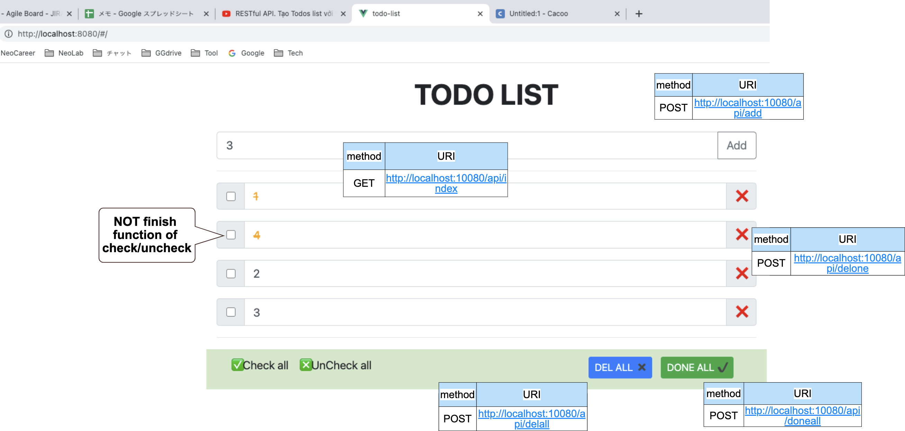
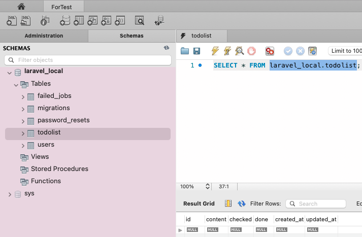
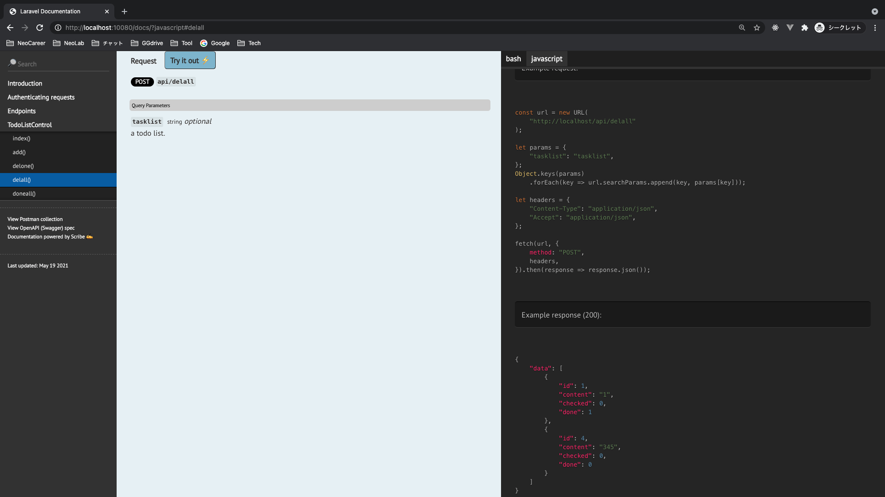

# Vue2 Laravel8 CRUD todo list 🐳


[](https://github.com/tquangdo/vue2-laravel8-crud-todolist/issues/new)



## localdeploy
1. root path
- `docker-compose up -d --build`
- `docker-compose exec app bash`
- `[app] $ composer install`
- `[app] $ cp .env.example .env`
- `[app] $ php artisan key:generate`
- `[app] $ php artisan migrate`
2. in Vue path
> just the 1st time when create project: START
- `npm install -g vue-cli`
- `vue init webpack todo-list`
> just the 1st time when create project: END
- `cd todo-list`
- `npm i`
- `npm run dev`
- browser: access "localhost:8080"

## connect DB
1. in CLI
- `docker-compose exec db bash -c 'mysql -u${MYSQL_USER} -p${MYSQL_PASSWORD} ${MYSQL_DATABASE}'`
- `mysql> show tables;`
2. by tools (MySQL Workbench)
- username: `root`
- pw: `secret`
- port: `33060`


## output log
- edit in `backend/.env`: `LOG_CHANNEL=stderr`
- edit in `backend/routes/web.php`:
```php
Route::get('/', function () {
    logger('welcome route.');
    return view('welcome');
});
```
- `docker-compose logs -f app`
- browser: access "localhost:10080" => will see 'welcome route.' in log console

## check versions
1. PHP: `[app] # php -v`
>(PHP info: `[app] # php -m`)
2. composer: `[app] # composer -v`
3. laravel: `[app] $ php artisan -v`

## backend
### Migration
- `[app] $ php artisan make:migration create_todolist_table`
- `[app] $ php artisan migrate`
### MVC
- `[app] $ php artisan make:model TodoList`
- `[app] $ php artisan make:controller API/TodoListControl`
- `[app] $ php artisan make:resource TodoListCollection`
### scribe doc generator
https://scribe.readthedocs.io/
#### 1) install
1.
```shell
composer require --dev knuckleswtf/scribe
```
2.
```bash
php artisan vendor:publish --provider="Knuckles\Scribe\ScribeServiceProvider" --tag=scribe-config
```
- => create `/config/scribe.php`
#### 2) setting
1. `/config/scribe.php`: `'type' => 'laravel',`
2. create doc comment in `*Controller.php`
#### 3) generate
```shell
php artisan scribe:generate
```
#### 4) result
access browser `http://localhost:10080/docs/`

